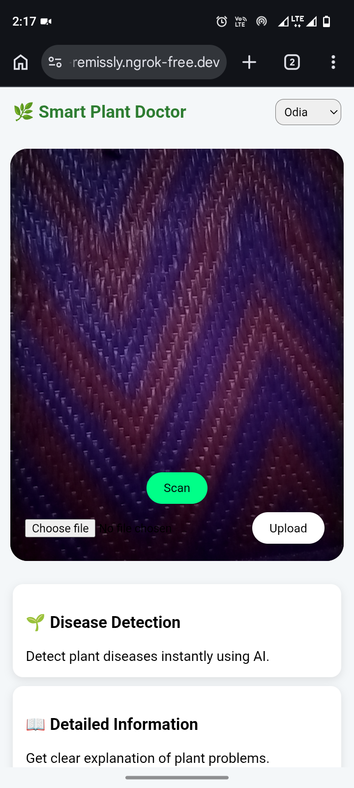
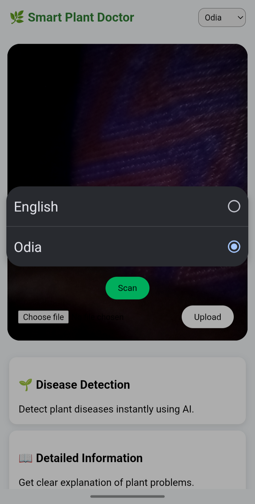
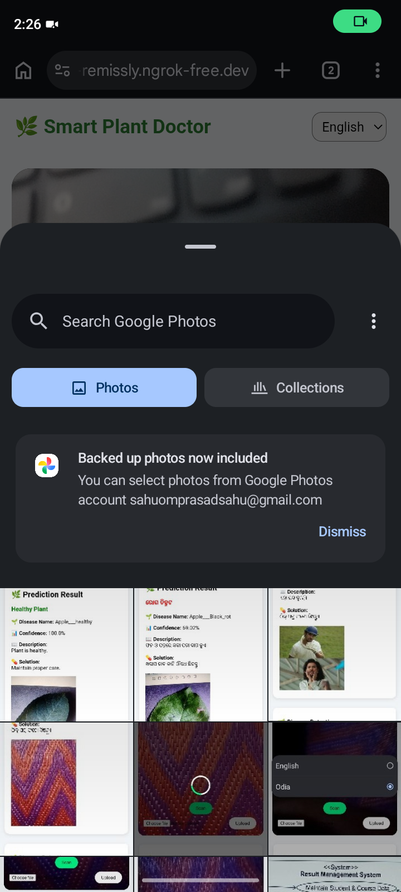
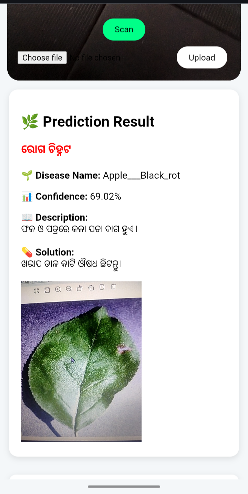
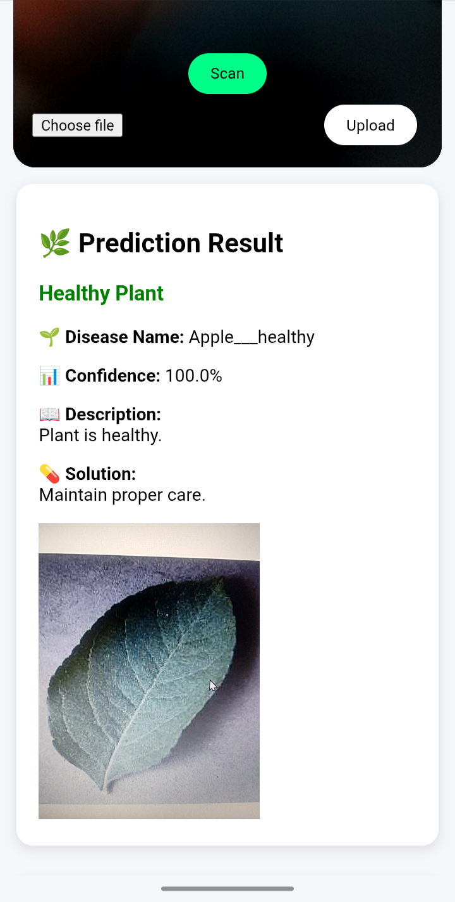
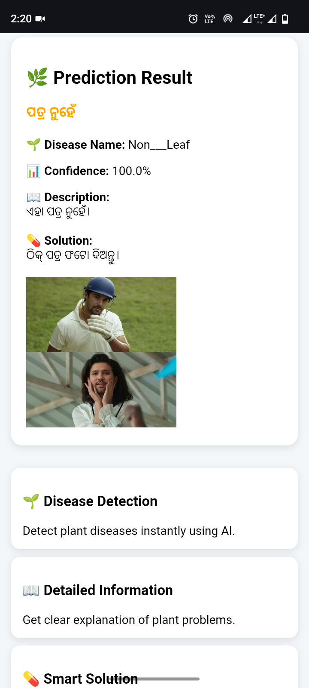

# 🌱 Farmer App – Plant Disease Detection System

> 🚀 Open to internship opportunities in AI/ML, Software Development, and Data Science | Actively seeking opportunities

---

## 🚀 Overview

Farmer App is a Machine Learning-based web application that helps farmers identify plant diseases from leaf images and get instant solutions.

This app uses deep learning models to:

* Detect plant type 🌿
* Identify disease 🦠
* Provide treatment/solution 💊
* Support multiple languages (English + Odia)

---

## 🎯 Features

* ✔ Plant detection using CNN model
* ✔ Disease classification using deep learning
* ✔ Solution & description for each disease
* ✔ Confidence score display
* ✔ Supports camera & file upload
* ✔ Multilingual support (English + Odia)

---

## 📸 Screenshots

Below are real screenshots of the application in action:

### 🏠 Home Page



### 🌐 Language Selection



### 📤 File Upload



### 🦠 Disease Prediction



### ✅ Healthy Prediction



### ⚠️ Non-Leaf Detection



---

## 🧠 How It Works

1. User uploads leaf image
2. Image is preprocessed
3. Plant model detects plant type
4. Disease model predicts disease
5. App displays:

   * Disease name
   * Description
   * Solution
   * Confidence score

---

## 🛠 Tech Stack

* Python
* Flask
* TensorFlow / Keras
* NumPy
* OpenCV
* HTML, CSS

---

## 📂 Project Structure

```
farmer-app/
│
├── app.py
├── requirements.txt
├── README.md
│
├── models/
│   ├── plant_image_classifier.keras
│   ├── final_model.keras
│   ├── plant_classes.json
│   ├── class_names.json
│
├── templates/
├── static/
├── screenshots/
```

---

## ⚙️ Installation & Setup

### 1️⃣ Clone repository

```
git clone https://github.com/sahuomprasadsahu/Farmer_app.git
cd Farmer_app
```

### 2️⃣ Install dependencies

```
pip install -r requirements.txt
```

### 3️⃣ Run the app

```
python app.py
```

### 4️⃣ Open in browser

```
http://localhost:5000
```

---

## 📊 Model Information

* Plant Model: MobileNetV2 (Transfer Learning)
* Disease Model: MobileNetV2 (Transfer Learning)
* Framework: TensorFlow / Keras

---

## 📁 Dataset

Dataset is not included due to size limitations.

You can use plant disease datasets from:

* Kaggle (PlantVillage Dataset)
* Custom datasets

---

## ⚠️ Limitations

* Supports limited plant types (10–11 crops only)
  (Apple, Cherry, Corn, Grape, Peach, Pepper, Potato, Rice, Strawberry, Tomato, Non-Leaf)
* Model accuracy depends on image quality
* Cannot detect all possible plant diseases
* May give incorrect prediction for unknown plants
* Requires clear leaf images for best results
* Not suitable for real-time large-scale farming use

---

## 🔮 Future Improvements

* Real-time camera scanning
* More crop support
* Higher accuracy models
* Mobile app version

---

## 🙌 Motivation

Farmers often face difficulty in identifying plant diseases early.
This project aims to provide a simple AI-based solution to assist them.

---

## 📬 Contact

If you like this project or have suggestions, feel free to connect.

* Name: Om Prasad Sahu
* Email: sahuomprasadsahu@gmail.com
* LinkedIn: https://www.linkedin.com/in/om-prasad-sahu-28756427b

---

## ⭐ Show your support

Give a ⭐ if you found this project useful!
